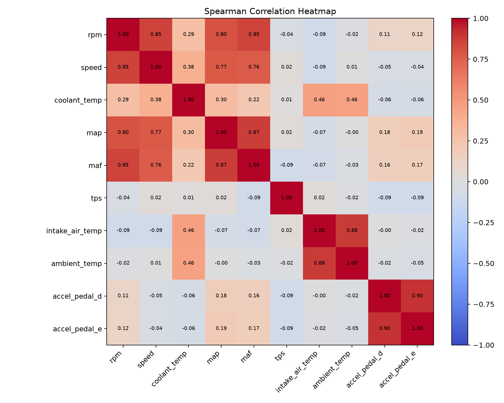
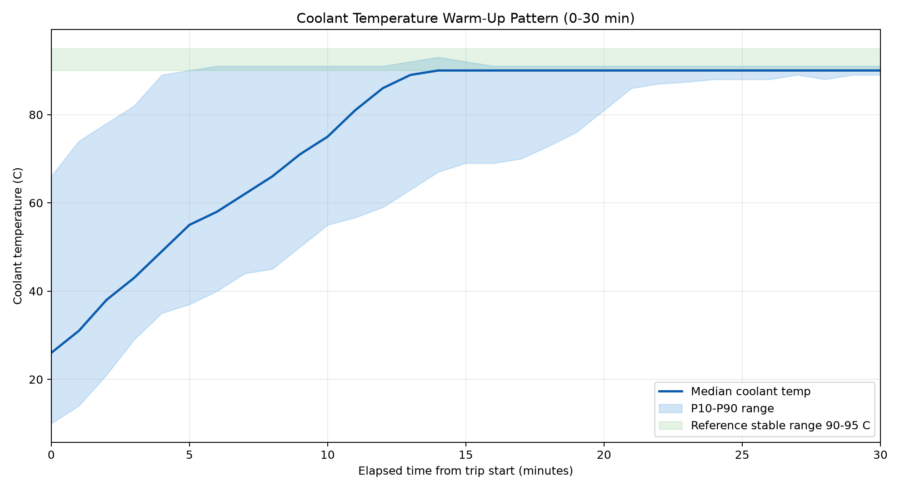
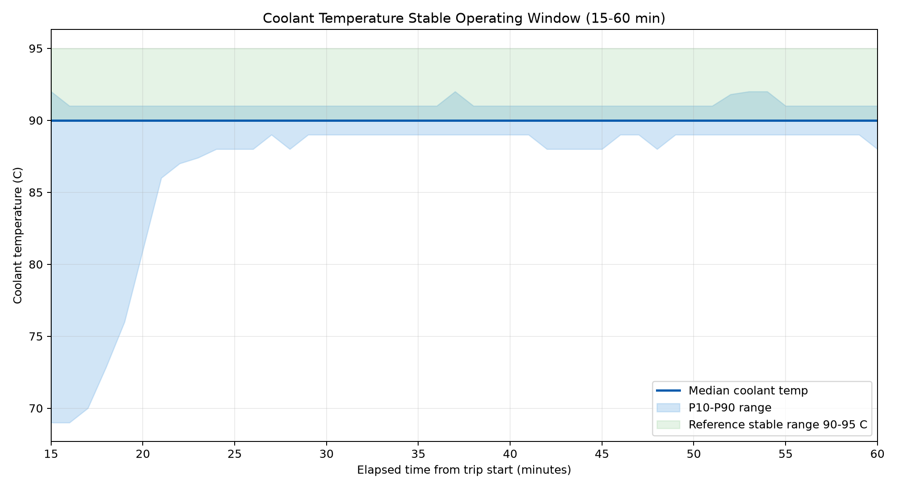

# Failure-Type Research (Model Layer — Anomaly Detection Epic)

Dataset: KIT Automotive OBD-II Dataset (81 trips, single Seat Leon, various driving conditions)

## The core problem
The dataset has **no real failure labels** — it's all healthy-vehicle driving data. The
dataset documentation (RADAR DOI: 10.35097/1130) describes road conditions via filename
suffixes (Normal, Frei, Stau, Messfehler) but does not explicitly state that the vehicle
was fault-free. We therefore treat this as a proxy healthy baseline, justified by:
1. No DTC/MIL fault codes are present in the logged signals.
2. Core sensor statistics (see Healthy Baseline Reference Table below) fall within
   Seat Leon manufacturer-normal ranges and automotive industry standards [M1][M2].
3. Cross-signal correlations (e.g. MAF–MAP ~0.83) are consistent with normal engine
   behaviour [R3][R4].

Per the brief ("Define a proxy 'failure condition' if real labels are missing"), we analysed
the available sensor signals across all 81 trips to find behaviours that plausibly indicate
component degradation, even though we cannot validate against an actual labelled failure.

---

## Confirmed anomaly types (notes/INTERFACE.md v0.3)

### 1. `cooling_degradation`

> *Proxy condition. The KIT dataset contains no real fault labels — this definition is based
> on expected sensor behaviour from automotive engineering literature, not labelled failures.*

**Component**: Cooling system — radiator / water pump / thermostat / coolant circulation
**Supporting features**: `coolant_temp`, `ambient_temp`, `speed`, `rpm`, `coolant_slope`,
`coolant_ambient_delta`, `coolant_stability` [B1]

**Findings (across 81 trips):**
- Steady-state coolant temp is typically **90–95°C** (normal thermostat range); a few trips
  reach **100–103°C**. Normal operating temperature is manufacturer-confirmed at 80–120°C
  (oil temperature equivalent, thermally coupled to coolant) [M1].
- Warm-up rate is **10–16°C/min** during cold start, dropping to ~0°C/min once warm.
- Cooling system operates under pressure, which raises the boiling point above 100°C —
  temperatures at or slightly above 100°C are therefore within normal operating range
  for a pressurised system with G12++/G13 coolant additive [M2, §4.30].

**Proxy definition**: Flag abnormal coolant thermal behaviour, including sustained
overheating after warm-up, coolant temperature rising without plateau, abnormally slow
warm-up, and coolant temperature implausible relative to ambient after cold soak [B1].

**Expected patterns:**
- **Overheating:** `coolant_temp` > 105°C sustained for 3–5 min after warm-up
- **Rising without plateau:** `coolant_slope` > 2°C/min for 2–3 min after warm-up phase
- **Slow warm-up:** `coolant_temp` < 70–75°C after 10–15 min running (possible thermostat
  stuck open)
- **Implausibility check:** `abs(coolant_temp − ambient_temp)` > 10–15°C after cold soak

This directly matches the brief's worked example: *"Coolant temperature rising faster than
normal — possible water pump degradation."* The detection target is the transition from
normal Zone B toward the warning Zone C as defined in the Seat Leon owner's manual [M1].
One-class classification approaches have been applied to this exact problem — coolant
sensor anomaly detection — using engineered features derived from the temperature time
series [R6].

**Signal deviation patterns:**

| Signal | Normal behaviour | Anomaly direction | Pattern |
|--------|-----------------|-------------------|---------|
| `coolant_temp` | 90–95°C steady state; up to 103°C in KIT data [M1][M2] | Sustained rise above 105°C | >105°C for 3–5 min post warm-up |
| `coolant_slope` | ~0°C/min once warm | >2°C/min | Persistent positive slope 2–3 min after warm-up ends |
| `coolant_stability` | Low rolling std dev (stable plateau) | High std dev | Irregular temperature fluctuations in steady state |
| `coolant_ambient_delta` | Large positive gap (engine hot vs ambient) | Abnormally small gap after cold soak | `abs(coolant_temp − ambient_temp)` < 10–15°C |

**Physical logic**: The cooling system prevents thermal overload, lubricating-oil burn-off,
and abnormal combustion. If temperature stays above the stable post-warm-up range for an
extended period, heat input and heat dissipation are out of balance [B1].

**Simulator implementation (`data_simulator.py`):**
`generate_normal_sequence()` models warm-up as `20 + 70 × (1 − exp(−t/30))`, clipped to
[20, 95] °C. `generate_cooling_degradation()` injects a 0.05 °C/s linear rise on all
post-85°C samples, mimicking water pump degradation. Story 6 uses this sequence as the
`cooling_degradation` ground-truth fault scenario.

---

### 2. `air_intake_maf_anomaly`

> *Proxy condition. The KIT dataset contains no real fault labels — this definition is based
> on expected sensor behaviour from automotive engineering literature, not labelled failures.*

**Component**: MAF sensor / intake air measurement path
**Supporting features**: `maf`, `map`, `rpm`, `intake_temp`, `maf_derived_air_load`,
`map_derived_air_load`, `maf_map_cohesion` [B1]

**Findings:**
- `maf` correlates with `map` at **~0.83 average** (range 0.6–0.9) — fairly consistent
  across trips [R3][R4].
- MAF is consistently the hardest OBD-II signal to predict: ARIMA achieves only MAPE
  37.71%, and LSTM R² 60.7% — the worst in both studies [R4][R3].
- **MAP range (turbocharged vehicle):** The Seat Leon 1.4 TSI regularly exceeds
  atmospheric pressure (~101 kPa) under boost. KIT dataset: MAP median 115.8 kPa, P99
  225 kPa, range 36–237 kPa. The "20–100 kPa" range applies to naturally aspirated
  engines only and is not valid for this vehicle.

**`maf_map_cohesion` formula (adopted from Data Layer Reference [B1]):**
```
maf_derived_air_load  = maf / max(rpm / 60, ε)          # g/rev
map_derived_air_load  = f_vehicle(map, intake_temp, rpm) # g/rev
maf_map_cohesion      = abs(zscore_vehicle(maf_derived_air_load)
                            − zscore_vehicle(map_derived_air_load))
```
Both air-load estimates are z-score standardised against a vehicle-specific healthy
baseline before differencing. This is more robust than a raw maf/map ratio because it
normalises for operating-point variation. Our earlier approximation (maf/map ratio,
band 0.1–0.3) was a placeholder; the z-score form is the agreed definition.

**Interim implementation (`kit_residual_detector.py`, 2026-07-04):** the z-score form
is now implemented with two simplifications until Story 5 fits the vehicle-specific
healthy baseline: (1) z-scores use current-trip statistics instead of a fitted healthy
baseline; (2) `map_derived_air_load` uses raw `map` as a speed-density proxy, since
`intake_temp` is not yet forwarded by the Data Layer (z-scoring absorbs the constant
factors). With trip statistics, healthy future-window means measured across 36
Normal/Frei trips ranged 0.10–1.56, so the interim trigger is calibrated at
**> 1.8** (full score at 3.0) rather than the 0.25–0.30 band expected under the
fitted-baseline form. Known limitation: a whole-trip uniform fault (e.g. `maf × 0.7`
over the entire trip) is invariant under in-window z-scoring — the TTM residual
scores still catch that case.

**Proxy definition**: Triggered when `maf_map_cohesion` remains high — indicates
inconsistency between the MAF-side and MAP-side air-load estimates, mainly from MAF
sensor drift, contamination, response delay, or intake measurement chain abnormalities.
Transient acceleration and gear-shift windows should be masked [B1].

**Expected pattern**: `maf_map_cohesion` > 0.25–0.30 sustained for 5–10 s; or under
steady-state conditions, the standardised deviation between `maf_derived_air_load` and
`map_derived_air_load` exceeds 25–30%.

**Signal deviation patterns:**

| Signal | Normal behaviour | Anomaly direction | Pattern |
|--------|-----------------|-------------------|---------|
| `maf` | Tracks MAP closely (~0.83 correlation) [R3] | Lower than MAP-predicted value | Sustained negative residual from MAP-expected baseline |
| `map` | 36–237 kPa, turbocharged; median ~116 kPa | Higher than MAF-consistent value | Elevated relative to actual air flow |
| `maf_map_cohesion` | Near 0 (z-scores aligned) | > 0.25–0.30 | Sustained standardised deviation between MAF-side and MAP-side load estimates |

**Physical logic**: Under the same operating condition, MAF-based load and MAP-based load
must remain physically consistent. Persistent deviation indicates a plausibility
abnormality in the air-mass measurement chain [B1].

**Simulator implementation (`data_simulator.py`) — updated 2026-07-04:**
MAP formula corrected from `30 + (rpm − 800) / 100` (peak ~52 kPa, wrong for turbo) to
`100 + (rpm − 800) / 30` clipped to [36, 237] kPa. MAF updated to `map × 0.2 + noise`
so the MAF/MAP relationship stays physically consistent for normal data. The full
z-score formula requires a healthy baseline which will be fitted in Story 5.
The two fault scenarios were renamed from the pre-v3 vocabulary
(`generate_vacuum_leak` / `generate_intake_blockage`) to a single method aligned
with the enum value: `generate_air_intake_maf_anomaly(variant=...)` —
`variant="map_bias"` applies `map × 1.3` / `tps × 0.7`;
`variant="low_maf"` applies `maf × 0.7` (the Story 6 scenario).

---

### 3. `accelerator_pedal_sensor`

> *Proxy condition. The KIT dataset contains no real fault labels — this definition is based
> on expected sensor behaviour from automotive engineering literature, not labelled failures.*

**Component**: Accelerator pedal position sensors (dual/redundant)
**Supporting features**: `accel_pedal_d`, `accel_pedal_e`, `accel_pedal_channel_delta`,
`accel_pedal_channel_ratio`, `pedal_slope` [B1]

**Findings:**
- Correlation is high (0.96–0.99) and consistent across all 81 trips — mean absolute
  difference ~0.8 percentage points.
- Brief spikes >10pp occur in ~1% of samples across all trips (likely sensor response lag
  during fast pedal movements, not faults).
- Both channels are SAE J1979 PID 0x49 (`accel_pedal_d`) and PID 0x4A (`accel_pedal_e`),
  reporting 0–100% [S1]. They are redundant by design — dual-channel agreement is a
  built-in safety feature of the pedal assembly [B1].

**Proxy definition**: The proportional relationship, correlation, or dynamic behaviour
between channels D and E is inconsistent. This proxies pedal sensor channel drift, contact
abnormalities, or redundancy-monitoring failure [B1].

**Expected pattern (adopted from Data Layer Reference):**
First learn the healthy vehicle-specific linear mapping `accel_pedal_e = a × accel_pedal_d + b`.
Then trigger if **any** of:
- Residual from the learned mapping remains > 5–10 pp
- Channel correlation coefficient falls below 0.95
- One channel changes while the other freezes for more than 1 s

Note: momentary divergence is not a useful discriminator (uniform across all normal trips).
The detection target is sustained divergence only.

**Signal deviation patterns:**

| Signal | Normal behaviour | Anomaly direction | Pattern |
|--------|-----------------|-------------------|---------|
| `accel_pedal_d` | Closely tracks `accel_pedal_e` (correlation 0.96–0.99) | Sustained divergence from E | Residual from learned `e = a·d + b` > 5–10 pp |
| `accel_pedal_e` | Closely tracks `accel_pedal_d` | Sustained divergence from D | Residual from learned `e = a·d + b` > 5–10 pp |
| `accel_pedal_channel_delta` | < 2 pp in normal driving | > 5–10 pp sustained | `abs(accel_pedal_d − accel_pedal_e)` exceeds threshold |
| `accel_pedal_channel_ratio` | ~1.0 (near-unity) | Sustained deviation from 1.0 | Proportional relationship between channels breaks |

**Physical logic**: The ETC system uses two potentiometers on the pedal for redundancy
and continuously checks all sensor readings that affect throttle opening while the engine
is running. Sustained divergence beyond normal pedal-response lag indicates a hardware
or electrical fault [B1].

**Simulator implementation (`data_simulator.py`) — updated 2026-06-25:**
Both signals now generated in `generate_normal_sequence()` from a shared base signal
`clip(10 + (rpm − 800) / 100, 14, 85)` plus independent ±1% noise, producing ~0.97
correlation under normal operation. `generate_pedal_sensor_fault()` injects a sustained
15 pp drop on pedal E from the quarter-way point, simulating the redundancy failure
target for Story 6.

---

---

## Pending anomaly types (in enum since INTERFACE.md v0.3 — Model Layer TBD)

The following four proxy failure types are defined in the Data Layer Reference [B1]
and were added to the `anomaly_type` enum on 2026-06-29 (`notes/INTERFACE.md`
Section 2.3, status "Pending — Data Layer defined, Model Layer TBD"). The detector
(`kit_residual_detector.py`) registers all four with a fixed 0.0 score and their
INTERFACE.md §2.4 `key_signals` priority, so interface JSON stays enum-complete;
detection logic starts once the Data Layer forwards the required signals
(`intake_temp`, `ambient_temp`, `intake_ambient_delta`, `map_slope`,
`pedal_throttle_gap`, `idle_flag`, `idle_rpm_stability`, `rpm_slope`). They remain
**outside** Story 6 evaluation scope, and the simulator deliberately has no
generators for them yet (their key signals are not simulator columns).

### 4. `intake_air_temperature_sensor_or_heat_soak_fault`

**Component**: Intake-air temperature sensing / intake-air temperature regulation
**Supporting features**: `intake_temp`, `ambient_temp`, `speed`, `rpm`, `tps`,
`intake_ambient_delta`, `intake_temp_slope`

**Proxy definition**: Intake temperature is abnormally high or low relative to ambient,
or does not vary with vehicle speed and load. Proxies IAT sensor faults, severe heat
soak, or poor thermal management in the intake path.

**Expected pattern**: After stable driving at `speed > 40 km/h` for 5 min,
`intake_temp − ambient_temp > 25–35°C`; or after extended running from cold start,
`intake_temp < ambient_temp − 5°C`; or under high load, `intake_temp > 60°C`.

**Physical logic**: Colder, denser intake air improves combustion efficiency. If intake
air is abnormally hot, effective oxygen content drops, reducing output and increasing
emissions [B1].

---

### 5. `map_load_signal_plausibility_fault`

**Component**: Intake manifold absolute pressure sensor / load signal
**Supporting features**: `map`, `maf`, `rpm`, `tps`, `intake_temp`,
`speed_density_maf_residual`, `map_slope`

**Proxy definition**: MAP cannot reasonably reflect load changes, or its relationship
with MAF, TPS, and RPM is inconsistent. Proxies MAP sensor drift, blockage, hose issues,
signal sticking, or load-measurement abnormalities.

**Expected pattern**: After a `tps` step change > 15 pp, `abs(map_slope)` remains near 0
within 1 s; or under steady state, air amount derived from MAP differs from MAF by > 25–30%;
or MAP remains near an unreasonable fixed value while the engine is running.

**Physical logic**: MAP is a preferred method for monitoring engine load. If MAP is
distorted, load, ignition, fuel injection, and torque calculations will all be biased [B1].

---

### 6. `electronic_throttle_tracking_fault`

**Component**: Electronic throttle control / throttle actuator
**Supporting features**: `accel_pedal_d`, `accel_pedal_e`, `tps`, `rpm`, `map`, `maf`,
`pedal_throttle_gap`, `pedal_to_throttle_delay`, `tps_slope`

**Proxy definition**: After pedal demand increases, throttle opening does not change
accordingly, or the actual throttle remains offset from the expected value for an extended
period. Proxies ETC actuator sticking, position-control abnormalities, or ETC entering
restricted-control mode.

**Expected pattern**: After `accel_pedal_mean` increases by > 20 pp, `tps` changes by
< 5 pp within 0.5–1.0 s; or `pedal_throttle_gap > 15–20 pp` for 2 s. Confidence is
higher if `map` and `maf` also show no response.

**Physical logic**: ETC calculates throttle opening from pedal position and operating
conditions, and uses a throttle angle sensor to confirm actual vs expected position.
Persistent mismatch indicates actuator or control-loop failure [B1].

---

### 7. `idle_speed_control_or_surge_degradation`

**Component**: Idle-speed control / engine-speed control
**Supporting features**: `rpm`, `speed`, `tps`, `accel_pedal_d`, `accel_pedal_e`, `maf`,
`map`, `idle_flag`, `idle_rpm_stability`, `rpm_slope`

**Proxy definition**: Under idle conditions, RPM fluctuation is excessive, cyclic surging
occurs, or the engine cannot stabilise near the target idle speed. Proxies idle-control
degradation, intake/ignition/fuel-injection disturbances, or insufficient load compensation.

**Expected pattern**: Within an idle window (`speed < 3 km/h`, `tps < 5–10%`, pedal near
0), RPM standard deviation > 50–100 rpm over 30 s, or peak amplitude > 150–200 rpm.

**Physical logic**: The goal of idle control is to maintain the desired idle speed under
all conditions. Persistent high fluctuation within the idle window directly reflects
control or combustion-stability issues [B1].

**Data Layer alignment**: the Data Layer's operating-condition state machine
(`data_layer/operating_condition_statistics/operating_condition_analysis.md`) already
classifies a kinematic `idle` state (`speed_smooth_kmh < 1 km/h` and
`|accel_ms2_smooth| < 0.15 m/s²`), which is the natural source for the `idle_flag` /
idle-window detection this type requires.

---

## Master Table Field Reference
All field names align with the Master Field Table in `notes/INTERFACE.md`:
- `coolant_temp` (Master Table #4)
- `coolant_slope` (Master Table #12)
- `maf` (Master Table #6)
- `map` (Master Table #5)
- `tps` (Master Table #7)
- `rpm` (Master Table #2)
- `load_stress` (Master Table #14)
- `maf_map_cohesion` (Master Table #15)

---

## External Standards — Signal Bounds and Operating Ranges

The normal operating ranges used in this project are grounded in two external sources,
independent of the KIT dataset:

### SAE J1979 OBD-II PID standard (measurement bounds)

Source: Wikipedia, "OBD-II PIDs" — https://en.wikipedia.org/wiki/OBD-II_PIDs
(Standard: SAE J1979 — defines mandatory OBD-II PIDs for all petrol/diesel vehicles)

These are the physical measurement bounds the sensor hardware can report.
Our normal operating ranges are a subset of these bounds.

| PID | Signal | Unit | SAE J1979 Min | SAE J1979 Max | Formula |
|-----|--------|------|---------------|---------------|---------|
| 0x05 | `coolant_temp` | °C | -40 | 215 | A − 40 |
| 0x0B | `map` | kPa | 0 | 255 | A |
| 0x0C | `rpm` | RPM | 0 | 16,383 | (256A+B)/4 |
| 0x0D | `speed` | km/h | 0 | 255 | A |
| 0x10 | `maf` | g/s | 0 | 655 | (256A+B)/100 |
| 0x11 | `tps` | % | 0 | 100 | (100/255)×A |
| 0x49 | `accel_pedal_d` | % | 0 | 100 | (100/255)×A |
| 0x4A | `accel_pedal_e` | % | 0 | 100 | (100/255)×A |

### Seat Leon MK3 owner's manual (normal operating zone and engine temperature range)

Sources:
- Seat Leon owner's manual coolant gauge — https://www.seatia.com/secon-482.html
- Seat Leon 2017 Owner's Manual (`Seat-Leon_2017_EN__3f5b99c0a7.pdf`) — engine oil
  temperature display section
- Seat Leon MK3 Workshop Maintenance Manual (`seat-leon-3-maintenance-eng.pdf`,
  EIGG000421, Edition 07.2018) — Sections 1.1, 4.29, 4.30

**Coolant temperature gauge — three zones (owner's manual):**
- **Zone A (cold):** Avoid high engine speeds and heavy loads.
- **Zone B (normal):** Needle in middle section of scale during normal driving. Temperature
  may rise under heavy load or high outside temperature; this is normal provided no warning
  lamp lights.
- **Zone C (warning):** Warning lamp illuminates. Stop the engine immediately and check
  coolant level. Do not continue driving. Exact °C threshold for Zone C not stated in
  owner's manual — qualitative zones only.

**Engine operating temperature — confirmed range (owner's manual, oil temperature display):**
> "The engine reaches its operating temperature when in normal driving conditions, the oil
> temperature is between **80°C and 120°C**. If the engine is required to work hard and the
> outside temperature is high, the engine oil temperature can increase. This does not
> present any problem as long as the warning lamps do not appear."

Coolant and oil temperature are thermally coupled. The 80–120°C engine operating envelope
from the manufacturer directly supports and bounds the 90–105°C normal coolant range
observed in the KIT dataset.

**Cooling system design (maintenance manual, Section 4.30):**
- Cooling system operates under pressure — raises the boiling point above 100°C, which
  is why normal coolant temperature can reach 100–105°C without boiling.
- Coolant additive further raises the boiling point (G12++/G13 specification).

**RPM operating range (maintenance manual, Section 1.1 — 1.4 TSI engines):**
- Peak power delivered between **4500–6000 RPM** depending on engine code (CZEA,
  CZCA, CHPA, CZDA variants).
- Torque band: **1400–4000 RPM** (lower variants) / **1500–3500 RPM** (higher variants).
- Normal driving RPM range: ~700 RPM idle to ~6000 RPM at full power.

This directly supports our proxy definition for `cooling_degradation`: predictive
detection aims to flag the transition from Zone B toward Zone C — sustained elevated
coolant temp and rising slope — before the warning lamp triggers. The manufacturer
confirms the engine is designed to operate in the 80–120°C thermal range; readings
persistently above 105°C with a positive slope after warm-up are the anomaly target.

---

## Data Health Validation Summary

Source: KIT Automotive OBD-II Dataset (Seat Leon MK3)
Validation by: Ray — Story 1 baseline analysis (`ttm-related/src/model/clean_obd2_normal_frei.py`,
`ttm-related/src/model/analyze_obd2_normal_frei.py`)

The dataset contains ten OBD-II signals collected from operating vehicles: engine RPM,
vehicle speed, coolant temperature, intake manifold absolute pressure (MAP), mass air flow
(MAF), throttle position, ambient temperature, intake air temperature, and two accelerator
pedal position signals (D and E). The dataset description does not provide explicit
diagnostic labels, fault-event annotations, DTC records, or MIL status. Therefore, this
validation does not attempt to prove that every vehicle record is mechanically healthy.
Instead, the aim is to confirm that the selected subset is stable and physically plausible
enough to serve as a healthy baseline for proxy threshold calibration.

### Dataset selection

Only files labelled `Normal` and `Frei` were retained, representing regular and free-flow
driving. Traffic jam files, measurement-error files (`Messfehler`), and invalid filenames
were excluded. The remaining 66 trips are treated as the healthy baseline for all proxy
threshold definitions.

| Item | Result |
|---|---:|
| Raw files inspected | 81 |
| Baseline files retained (`Normal` + `Frei`) | 66 |
| Rows after duplicate checking | 2,089,290 |
| Rows removed because all core signals were missing | 0 |
| Resampled analysis frequency | 1 second |

### Missing-value profile (after cleaning)

The missing-value profile is low for all primary model signals. `intake_air_temp` has the
highest rate because physically invalid values were set to missing during range filtering;
this signal is not used in the model layer and does not affect the anomaly detection pipeline.

| Signal | Missing after cleaning |
|---|---:|
| `rpm` | 0.0067% |
| `speed` | 0.0093% |
| `coolant_temp` | 0.0003% |
| `map` | 0.0035% |
| `maf` | 0.0157% |
| `tps` | 0.0188% |
| `intake_air_temp` | 1.1661% |
| `ambient_temp` | 0.0220% |
| `accel_pedal_d` | 0.0256% |
| `accel_pedal_e` | 0.0282% |

### Descriptive statistics (signal plausibility)

The major operating signals remain within physically reasonable ranges for normal vehicle
operation, supporting the plausibility of the cleaned subset.

| Signal | Median | P99 | Min–Max | Interpretation |
|---|---|---|---|---|
| `rpm` | 1,560 RPM | 2,664 RPM | 0–3,682 RPM | Plausible for stops, cruising, and normal acceleration |
| `speed` | 66 km/h | 157 km/h | 0–218 km/h | Plausible for mixed road driving |
| `coolant_temp` | 90°C | 94°C | −1–103°C | Stable warmed-up engine range |
| `map` | 115.8 kPa | 225 kPa | 36–236.9 kPa | Plausible intake pressure for turbocharged engine |
| `maf` | 19.3 g/s | 83.0 g/s | 0–122.7 g/s | Plausible airflow range under changing load |
| `tps` | 83.5% | 89% | 13.7–89% | Within valid percentage bounds |
| `accel_pedal_d/e` | 14.1/14.5% | 63.9/64.1% | 14.1–85.1% / 14.1–84.3% | Two pedal channels remain consistent |

### Correlation summary (Spearman, across all 66 healthy trips)

Key relationships confirmed consistent with normal engine behaviour:

| Pair | Spearman correlation | Interpretation |
|---|---|---|
| `rpm` vs `maf` | strong positive | Higher RPM draws more air — expected |
| `map` vs `maf` | strong positive | Higher manifold pressure → higher air flow |
| `tps` vs `maf` | moderate positive | Throttle opening drives air flow |
| `rpm` vs `speed` | moderate positive | Speed broadly tracks engine demand |
| `accel_pedal_d` vs `accel_pedal_e` | very strong positive (~0.96–0.99) | Dual-channel consistency confirmed |

The MAF–MAP strong positive correlation (~0.83 average) directly grounds the
`air_intake_maf_anomaly` proxy definition — a large or sustained deviation from this
relationship is the detection target.

The near-perfect `accel_pedal_d` / `accel_pedal_e` correlation grounds the
`accelerator_pedal_sensor` proxy definition — sustained divergence above 10 pp is the
detection target.

Throttle position shows weak negative correlations with pedal position and MAF and should
be interpreted cautiously. This likely reflects absolute throttle position calibration or
ECU control behaviour rather than a dataset issue, and is consistent with the known
difficulty of using TPS as a standalone anomaly signal [R4].



### Coolant temperature warm-up profile

The coolant-temperature plots provide the clearest single-signal health evidence. Median
coolant temperature rises from a low initial value to approximately 90°C within ~14 minutes,
then stabilises in the 90–95°C band — consistent with normal engine thermal behaviour and
the Seat Leon owner's manual Zone B [M1].

- **Normal warm-up rate:** ~10–16°C/min during cold start, falling to ~0°C/min once warm.
- **Normal steady-state:** 90–95°C (consistent with Seat Leon MK3 owner's manual Zone B).
- **Proxy anomaly boundary:** Sustained `coolant_temp` above ~100°C and/or `coolant_slope`
  persistently above 2–3°C/min after warm-up (i.e., outside the stabilised band).

> **Note:** The warm-up summary pools all 66 trips regardless of starting temperature.
> Trips where the engine was already warm pull up the minute-0 median and compress the
> apparent warm-up curve. The "~14 minutes to 90°C" figure is a blended average across all
> starting conditions, not a pure cold-start warm-up time.

Plots generated by `analyze_obd2_normal_frei.py`:





### Overall validation conclusion

The `Normal` + `Frei` subset shows low missingness, physically plausible signal ranges,
normal coolant warm-up and stabilisation behaviour, and strong expected relationships among
RPM, speed, MAP, MAF, and accelerator pedal signals. These results support using this
cleaned subset as a stable baseline dataset for subsequent time-series modelling and proxy
threshold calibration. The dataset does not contain diagnostic labels and therefore cannot
prove complete mechanical health — all failure conditions defined in this document remain
proxy definitions, not verified faults.

---

## Healthy Baseline Reference Table

Source: KIT Automotive OBD-II Dataset (Seat Leon MK3, Normal/Frei trips, Messfehler excluded)
Computed by: Ray — Story 1 baseline analysis
Industry ranges: Seat Leon MK3 owner's manual + SAE J1979 standard (see External Standards above)

Computed from the 1-second resampled cleaned CSV (`obd2_normal_frei_cleaned_1s.csv`, 66
Normal/Frei trips). Derived features (`coolant_slope`, `maf_map_cohesion`, `load_stress`,
`rpm_variation`) are not directly present in the raw CSV; their reference ranges come from
automotive engineering literature and cross-signal reasoning (see External Standards above).

| Signal | Unit | SAE J1979 bound | Industry / Seat Leon normal range | KIT Mean | KIT Std | KIT P5 | KIT P95 | KIT Median | KIT P99 | KIT Min | KIT Max |
|--------|------|-----------------|----------------------------------|----------|---------|--------|---------|------------|---------|---------|---------|
| `coolant_temp` | °C | -40 to 215 | 85–105 (gauge Zone B) | 81.19 | 18.35 | 37.00 | 92.00 | 90.00 | 94.00 | −1.00 | 103.00 |
| `rpm` | RPM | 0 to 16,383 | 600–6500 | 1,520 | 517 | 770 | 2,190 | 1,560 | 2,664 | 0 | 3,682 |
| `speed` | km/h | 0 to 255 | 0–130 | 64.75 | 45.50 | 0.00 | 128.73 | 66.00 | 157.00 | 0 | 218 |
| `map` | kPa | 0 to 255 | 20–100 | 126.65 | 31.20 | 98.00 | 196.18 | 115.82 | 225.00 | 36.00 | 236.90 |
| `maf` | g/s | 0 to 655 | 2–25 | 23.34 | 16.06 | 7.03 | 54.61 | 19.31 | 83.03 | 0.00 | 122.72 |
| `tps` | % | 0 to 100 | 0–80 | 81.24 | 10.68 | 69.18 | 83.50 | 83.50 | 89.00 | 13.70 | 89.00 |
| `accel_pedal_d` | % | 0 to 100 | 0–100 | 21.60 | 12.44 | 14.10 | 47.68 | 14.10 | 63.88 | 14.10 | 85.10 |
| `accel_pedal_e` | % | 0 to 100 | 0–100 | 21.92 | 12.47 | 14.50 | 48.35 | 14.50 | 64.10 | 14.10 | 84.30 |
| `coolant_slope` | °C/min | — | 0–2 (steady state) | *derived* | *derived* | — | — | — | — | — | — |
| `maf_map_cohesion` | ratio | — | 0.1–0.3 | *derived* | *derived* | — | — | — | — | — | — |
| `load_stress` | rpm×% | — | 0–200,000 | *derived* | *derived* | — | — | — | — | — | — |
| `rpm_variation` | RPM | — | 0–500 | *derived* | *derived* | — | — | — | — | — | — |

**Notes on KIT observations vs. reference ranges:**

- `map` median (115.8 kPa) exceeds the nominal `REFERENCE_RANGES` upper bound of 100 kPa.
  The KIT dataset includes manifold pressures above atmospheric (turbocharged Seat Leon 1.4 TSI),
  which can exceed 100 kPa under boost. The `REFERENCE_RANGES` value should be reviewed and
  widened if needed to avoid false positives on normal boosted driving.
- `speed` P99 (157 km/h) and Max (218 km/h) exceed the current `REFERENCE_RANGES` cap of
  120 km/h. These represent highway driving present in `Frei` trips and are not anomalous.
  The cap can be raised to ~160 km/h without affecting anomaly detection fidelity.
- `tps` median (83.5%) sits near the `REFERENCE_RANGES` upper bound of 80%. Absolute throttle
  position in this dataset appears to use a different zero/scale calibration than expected.
  Throttle position should be interpreted cautiously and correlated with MAF rather than used
  as a standalone threshold signal.
- `coolant_temp` Max of 103°C falls within the pressurised coolant system's normal operating
  ceiling (see External Standards — Seat Leon MK3 Workshop Manual, Section 4.30). The proxy
  anomaly threshold of ~100°C with sustained positive slope remains valid.

---

## References

### Automotive Engineering

**[B1]** Robert Bosch GmbH, *Bosch Automotive Handbook*, 10th edition.
Cited for: proxy failure definitions and expected patterns for `cooling_degradation`,
`air_intake_maf_anomaly`, `accelerator_pedal_sensor`, and the four additional proxy
types (§3.1–3.7 of the Data Layer Reference); derived feature physical rationale
(`coolant_slope`, `coolant_stability`, `coolant_ambient_delta`, `maf_derived_air_load`,
`map_derived_air_load`, `maf_map_cohesion`, `accel_pedal_channel_delta`,
`accel_pedal_channel_ratio`).

### Manuals

**[M1]** SEAT, *León Owner's Manual*, 2017.
File: `documetation/相关论文/manual/Seat-Leon_2017_EN__3f5b99c0a7.pdf`
Cited for: coolant temperature gauge zones (A/B/C), engine oil operating temperature
range (80–120°C).

**[M2]** SEAT, *León / León ST Workshop Maintenance Manual*, Edition 07.2018,
Reference EIGG000421. File: `documetation/相关论文/manual/seat-leon-3-maintenance-eng.pdf`
Cited for: 1.4 TSI engine codes and RPM ranges (§1.1); cooling system pressure and
boiling point rationale (§4.30); coolant additive specification G12++/G13 (§4.30).

### Standards

**[S1]** SAE International, *SAE J1979: E/E Diagnostic Test Modes* (OBD-II PID standard).
Reference via: "OBD-II PIDs," Wikipedia, https://en.wikipedia.org/wiki/OBD-II_PIDs.
Cited for: signal physical measurement bounds (PID 0x05 coolant_temp, 0x0B MAP, 0x0C RPM,
0x0D speed, 0x10 MAF, 0x11 TPS, 0x49 accel_pedal_d, 0x4A accel_pedal_e); MAF upper
bound corrected to 655 g/s from SAE maximum.

### Academic Papers

**[R1]** V. Ekambaram et al., "Tiny Time Mixers (TTMs): Fast Pre-trained Models for
Enhanced Zero/Few-Shot Forecasting of Multivariate Time Series," IBM Research, *NeurIPS
2024*. File: `documetation/相关论文/ttm.pdf`
Cited for: TTM zero-shot forecasting methodology; prediction residual as anomaly score;
multivariate OBD-II channel modelling; exogenous variable (driver-controlled signals)
treatment.

**[R2]** Z. Darban et al., "Deep Learning for Time Series Anomaly Detection: A
Comprehensive Survey," *ACM Computing Surveys*, Vol. 57, No. 1, Article 15, Oct 2024.
File: `documetation/相关论文/Deep Learning for Time Series Anomaly Detection.pdf`
Cited for: prediction-based anomaly detection taxonomy; trend anomaly definition
(persistent slope shift); F1/AU-PR evaluation metrics for imbalanced fault data; NDT/POT
thresholding methods.

**[R3]** A. Errezgouny et al., "An Integrated Deep Learning Approach for Predictive
Vehicle Maintenance," *Decision Analytics Journal*, 16, 2025, 100597.
File: `documetation/相关论文/an_intergrated_deep_learning_approac_predictive_vehicle_maintence.pdf`
Cited for: MAF R² 60.7% (hardest OBD-II signal to predict); MAF–TPS correlation 92%;
feature selection confirming RPM, Engine Load, MAF, TPS as core OBD-II signals; LSTM
baseline R² ~89–90% as comparison target.

**[R4]** (Author not stated in summary), "Data Modeling and Prediction of OBD-II Time
Series." File: `documetation/相关论文/Data_modeling_and_prediction.pdf`
Cited for: ARIMA MAPE results — MAF 37.71% (worst), MAP 22.89%, RPM 13.81%;
MAF–TPS correlation 92.3%; driver-controlled vs engine-response signal predictability
distinction.

**[R5]** (Multiple authors), "A Review of OBD-II-Based Machine Learning Applications for
Sustainable, Efficient, Secure, and Safe Vehicle Driving," *Sensors*, 2025.
File: `documetation/相关论文/A Review of OBD-II-Based Machine Learning Applications for Sustainable, Efficient, Secure, and Safe Vehicle Driving.pdf`
Cited for: key OBD-II features for health monitoring (coolant temp, RPM, engine load,
MAF); vehicle health monitoring section (§4.4); evaluation metric conventions.

**[R6]** (Author not stated in summary), "Detecting Anomalies in the Engine Coolant
Sensor Using One-Class Classifiers."
File: `documetation/相关论文/Detecting_Anomalies_in_the_Engine_Coolant_Sensor_Using_One-Class_Classifiers.pdf`
Cited for: coolant sensor anomaly detection using engineered time-series features;
direct precedent for the `cooling_degradation` proxy condition.

**[R7]** (Author not stated in summary), "Advancing Vehicle Diagnostics: Exploring the
Application of Large Language Models in the Automotive Industry."
File: `documetation/相关论文/Advancing Vehicle Diagnostic Exploring the Application of Large Language Models in the Automotive Industry.pdf`
Cited for: LLM role as explainability layer (not core detector); capability limits of
LLMs in complex real-world fault classification.

**[R8]** Hermawan et al., "OBD-II Driving Behavior Survey," 2020.
File: `documetation/相关论文/Hermawan_2020_OBDII_driving_behavior_survey.pdf`
Cited for: OBD-II system definition and monitored component scope; sensor data role in
vehicle and driver state characterisation.

**[R9]** Z. Darban et al., "Unsupervised Anomaly Detection in Time-Series: An Extensive
Evaluation and Analysis of State-of-the-Art Methods," 2024.
File: `documetation/相关论文/Unsupervised anomaly detection in time-series- An extensive evaluation and analysis of state-of-the-art methods.pdf`
Cited for: unsupervised anomaly detection method benchmarks; evaluation on unlabelled
time-series data consistent with KIT dataset constraints.
